# 性能优化路径全记录

> 项目：Clash of Clans Clone (Unity 2022.3 TuanJie Android)
> 优化时间线：2026-05 ~ 2026-06
> 目标：将 60 单位战斗从 ~54ms/帧（~18 FPS）优化至 ~4.5ms/帧（稳定 60+ FPS）

---

## 优化总览

```
稳定战斗 (初始)         Burst 优化              Job 引入              预算型微批处理 (最终)
~33-54ms/帧             ~49ms/帧(峰值)         ~32ms/帧(峰值)         ~4.5ms/帧
~18-30 FPS              ~20 FPS                ~31 FPS                稳定 60+ FPS
GC 重度抖动              GC 明显下降            多线程并行              峰值削平
```

---

## Phase 0：稳定战斗 — 初始性能基线

### 指标快照

| 指标 | 数值 |
|------|------|
| 帧时间 | 33~54ms（峰值 54ms） |
| FPS | ~18-30 |
| GC.Collect 耗时 | 42ms（单次 GC 暂停） |
| 总内存 | ~387.8 MB |
| 托管堆 | ~38.6 MB |
| 热点方法 | `UI_Battle.Update` 87.7%，`Battle.HandleUnits` 73.6% |

### 问题诊断

- **`Battle.HandleUnits`** 是最大热点，占总帧时间的 73.6%
- 内部存在大量 **LINQ 表达式**、**每帧 `new List<T>`**、**临时字符串拼接** 等产生 GC 分配的操作
- **`GC.Collect`** 在热路径中被触发，耗时占 HandleUnits 的 7.4%，导致严重的帧停顿
- A* 寻路使用的 `Cell` 是 **class（引用类型）**，每次 Reset 需 O(2401) 全量清零
- `FastPriorityQueue` 等内部数据结构均为托管对象

### 证据截图

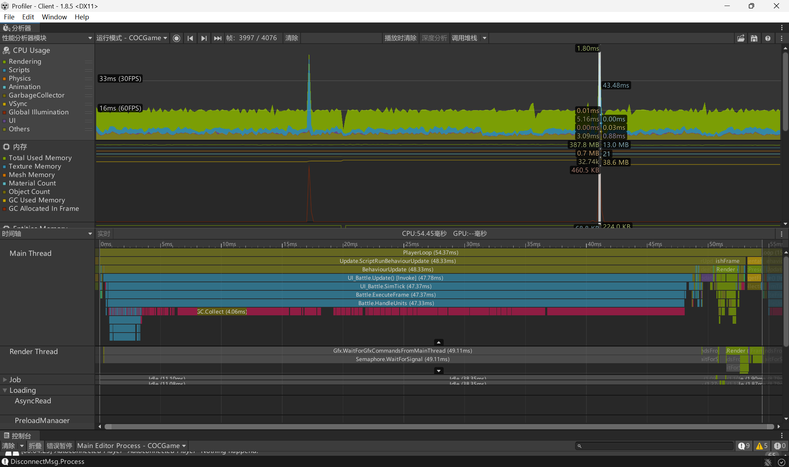

> **图1：初始 Timeline** — 帧时间峰值 54.37ms，主线程 `UI_Battle.Update` 独占 47.78ms，渲染线程 `Gfx.WaitForGfxCommandsFromMainThread` 等待 49.11ms。可见 CPU 主线程严重阻塞。

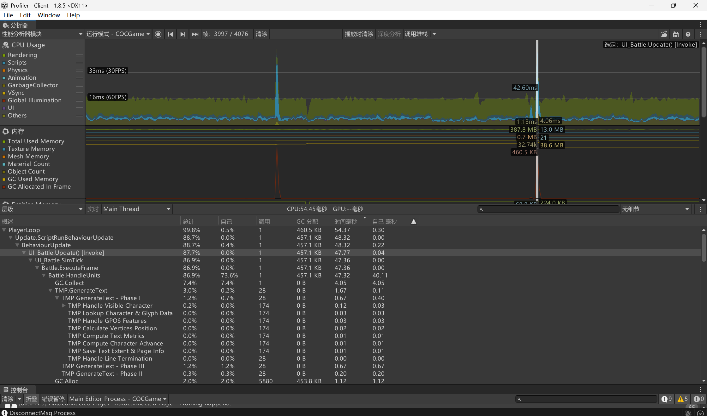

> **图2：初始层级分析** — `UI_Battle.Update [Invoke]` 占 87.7%，`Battle.HandleUnits` 占 73.6%，`GC.Collect` 占 HandleUnits 的 7.4%。大量 GC.Alloc 产生于热路径。

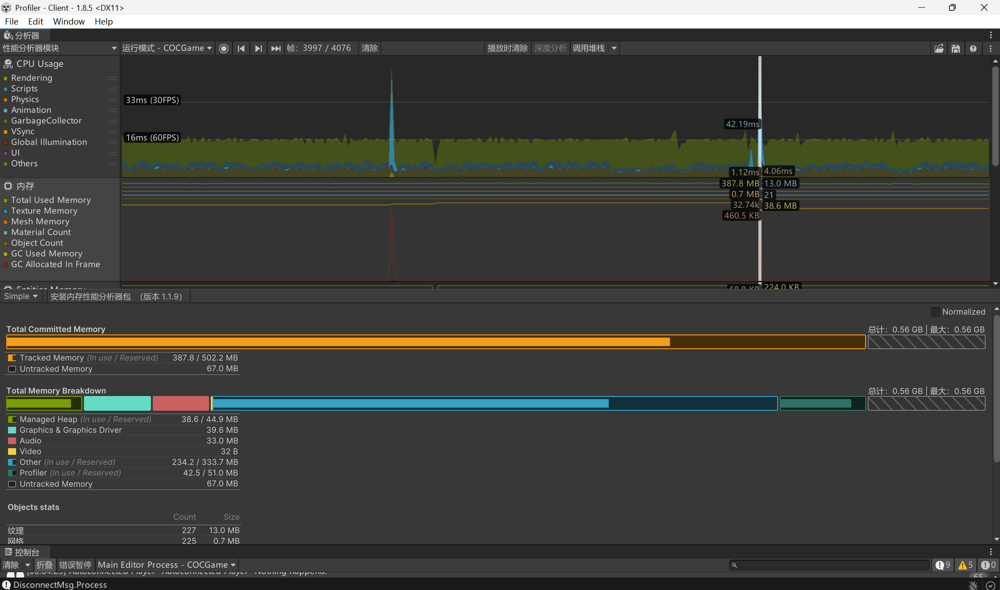

> **图3：初始内存状态** — 总内存 0.56 GB，托管堆 38.6 MB。可见 42.19ms 的巨大 GC 尖峰（蓝色脉冲），这是由频繁的托管对象分配触发的。

---

## Phase 1：Burst 改造 — 消除 GC 压力

### 改造目标

消除热路径上的托管对象分配，将寻路数据结构改造为 Burst 兼容的值类型。

### 关键改动

#### 1. 移除 LINQ 与临时分配

围绕 `Battle.HandleUnits` 做了一轮不改变游戏行为的纯压缩：

- 删除所有 LINQ 表达式（`.Where()` / `.OrderBy()` / `.ToList()` 等）
- 将高频目标筛选逻辑改写为专用顺序扫描函数：
  - `TryGetClosestTarget` — 单次遍历查最近目标
  - `UpdateClosestTarget` + `TryGetClosestAllTarget` — 分候选池比较
  - `FillSortedTargets` — 复用 `sortedTargetBuffer`，避免每次新建集合
- `AssignTarget` 直接遍历候选字典比较，不再构造中间集合
- `GetPathToWall` / `GetPathToBuilding` 改为边遍历边判断，不再转换临时结构

#### 2. 路径数据扁平化

为 Burst 编译做准备：

- `AStarSearch` 新增 `FindLocations()` 直接返回 `Vector2Int[]`，不再通过 `Cell.Parent` 链回溯
- `Vector2Int` 改造为完整值类型：实现 `IEquatable<T>`、`GetHashCode`、`Equals`
- `Battle.Path` 不再持有 A* 内部 `Cell` 引用，直接存储 `NativeArray<Vector2Int>` 点集
- `Path.Create` 接收扁平数组，`GetPathLength` / `CountBlockingWalls` 围绕数组运算

#### 3. Burst Job 化路径数学

- 创建 `[BurstCompile] IJob` 封装 `GetPathLength` 和 `GetPathPosition`
- 使用 Battle 级别的持久 scratch buffer（`NativeArray<float>` / `NativeArray<BurstPathPosition>`）
- 路径数学计算从托管执行迁移到 Burst 编译执行

#### 4. A* 算法 Burst 化（Phase B）

- 新建 `BurstAStarJob.cs`（~260行），完整重写 A* 搜索为 `IJob`：
  - `BurstNodeData` struct：`float G/H/F`、`int ParentIndex/HeapIndex/SearchId`、`byte Closed`（全 blittable）
  - 扁平索引 `y * gridW + x` 替代 `Cell[,]` 二维数组
  - 1-indexed `NativeArray<int>` 最小堆
  - Octile Distance 启发式（float 版）
- 建立双套 blocked 数组：
  - `burstSearchBlocked` — 有障碍模式（真实墙体布局）
  - `burstUnlimitedBlocked` — 无障碍模式（用于判断"如果没有墙路径多长"）
- 所有 blocked 状态在 `Initialize()` 和 `DamageBuilding()` 时同步写入 NativeArray

#### 5. Grid Epoch O(1) 重置（Phase A）

- `Cell` 新增 `SearchId` 字段
- `AStarSearch` 新增 `_searchEpoch`，每次搜索前递增
- `EnsureCellFresh(Cell cell)` — 首次访问时 O(1) 惰性初始化
- `Reset()` 从 O(2401) 降为 O(1)

### 效果对比

| 指标 | 优化前（Phase 0） | Burst 优化后 |
|------|-------------------|-------------|
| GC.Alloc/frame | 高频大块分配（触发 42ms GC） | 33.8 KB（显著下降） |
| 托管堆压力 | GC 频繁抖动 | GC 明显缓解 |
| 寻路数据结构 | 托管 class（Cell 等） | NativeArray + blittable struct |
| 路径数学 | C# 托管执行 | Burst 编译执行 |

### 证据截图

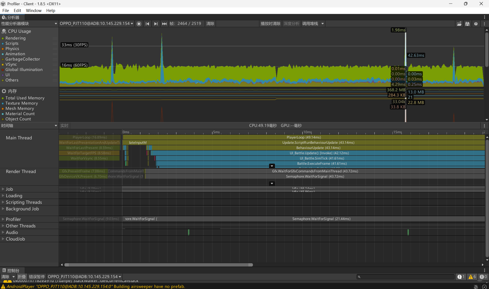

> **图4：Burst 优化后 Timeline** — 帧时间峰值 49.19ms（约 20 FPS），主线程仍有 `UI_Battle.Update` 42ms 的瓶颈。虽然 GC 明显改善，但主线程计算负载仍然过重。

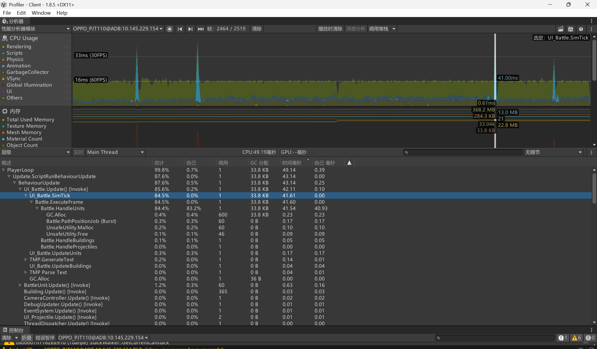

> **图5：Burst 优化后层级** — `UI_Battle.SimTick` 占 84.5%，`Battle.HandleUnits` 自耗时 83.2%。GC 分配已降至 33.8 KB（注意这是 Burst 编译版本，但寻路仍为 `.Run()` 同步串行执行）。

---

## Phase 2：Job 多线程引入 — 并行寻路

### 改造目标

将 A* 寻路从主线程 `.Run()` 同步串行改为 `.Schedule()` 多线程并行执行，利用 CPU 多核。

### 关键改动

#### 调度模式转换：从 Run 到 Schedule+Complete

```
Phase 1 (Run 模式):
  Run() → 主线程同步执行 A*
  Run() → 主线程同步执行 A*
  ...
  总耗时 = 8 × 单次 A* 时间

Phase 2 (Schedule + Complete 模式):
  Schedule() → Worker Thread 1 执行
  Schedule() → Worker Thread 2 执行
  Schedule() → Worker Thread 3 执行
  ...
  Complete() → 主线程阻塞等待全部完成
  总耗时 ≈ max(单次 A* 时间) + 调度开销
```

#### Scratch Pool 设计

建立 64 槽位的 A* 计算池，预分配 Persistent NativeArray：

```csharp
const int ASTAR_POOL_SIZE = 64;

NativeArray<BurstNodeData>[] _astarPoolNodes;      // 每槽独立的节点状态
NativeArray<int>[]           _astarPoolHeaps;       // 每槽独立的最小堆
NativeArray<Vector2Int>[]    _astarPoolResultPaths; // 每槽独立的路径结果
NativeArray<int>[]           _astarPoolResultLengths; // 结果长度

int[]   _astarPoolEpochs;     // 每槽 epoch
int     _astarPoolNextSlot;   // 轮转指针
```

#### 三阶段流水线

```
Phase A: Queue（收集）
  ScheduleBurstFindLocations(...) → 只占槽位，不执行计算
  _pendingAStar.Add(...)

Phase B: Execute（执行）
  FlushBurstRequests() → 为所有 pending 创建 Job → 全部 .Schedule()
  JobHandle.CombineDependencies(handles).Complete() → 同步等待
  _pendingAStar.Clear()

Phase C: Read（读取）
  GetBurstResult(slot, out count, out path) → 取出结果
```

#### 调用模式变换

```csharp
// Phase 1: 串行 Run
for (x) for (y) {
    int c1 = BurstFindLocations(false, start, goal);  // 阻塞主线程
    int c2 = BurstFindLocations(true, start, goal);   // 阻塞主线程
}

// Phase 2: 收集 → 批量 Schedule → 批量 Read
for (x) for (y) {
    searchSlots[i]    = ScheduleBurstFindLocations(false, start, goal);  // 只入队
    unlimitedSlots[i] = ScheduleBurstFindLocations(true, start, goal);   // 只入队
}
FlushBurstRequests();  // 全部 Schedule + Complete
for (x) for (y) {
    GetBurstResult(searchSlots[i],    out c1, out p1);  // 读取
    GetBurstResult(unlimitedSlots[i], out c2, out p2);
}
```

### 效果对比

| 指标 | Burst 阶段 | Job 引入后 |
|------|-----------|-----------|
| 帧时间（峰值） | ~49ms | ~32ms |
| FPS | ~20 | ~31 |
| A* 执行方式 | 主线程串行 Run | Worker Thread 并行 Schedule |
| 寻路热点 | HandleUnits 83% | FindTargets 63% |

### Route B 探索：全量批处理方案（512 槽位，后弃用）

尝试将所有单位的寻路收集到同一帧一次 Flush：
- Pool size = 512，40 单位 × 8 A* = 320 个 Job 一帧 Schedule
- 结果：帧时间爆增至 **~22ms**，Complete 等待成为瓶颈
- 教训：**并行不是越多越好，Complete 同步等待是硬瓶颈**

### 证据截图

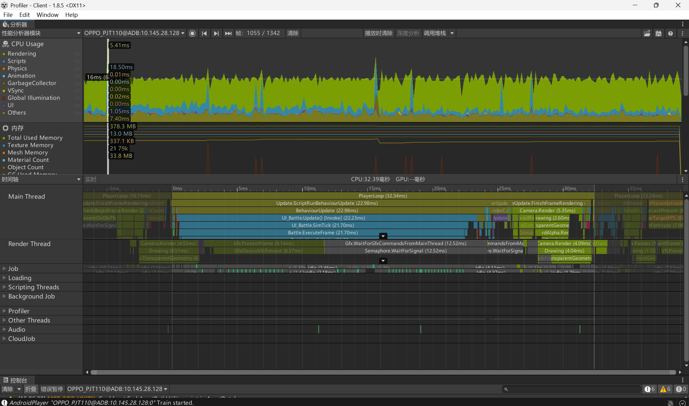

> **图6：Job 引入后 Timeline** — 帧时间 32.39ms（~31 FPS）。主线程 `UI_Battle.Update` 22.23ms，`Battle.ExecuteFrame` 21.70ms。Render Thread 的 `Gfx.WaitForGfxCommandsFromMainThread` 12.52ms，说明主线程仍是瓶颈但已大幅改善。

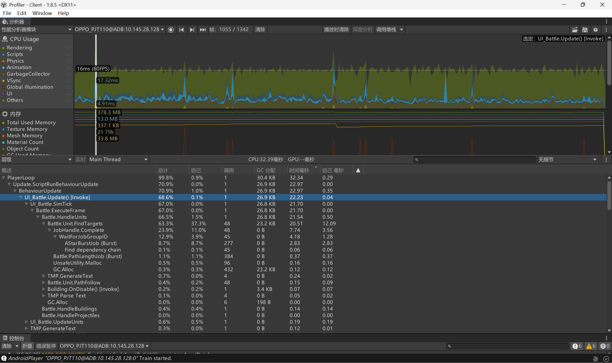

> **图7：Job 引入后层级** — `UI_Battle.Update [Invoke]` 68.6%，`Battle.Unit.FindTargets` 63.3%（调用 48 次，共 20.51ms）。`AStarBurstJob (Burst)` 已成功出现在层级中（8.7%），证明 Worker Thread 在并行执行寻路。

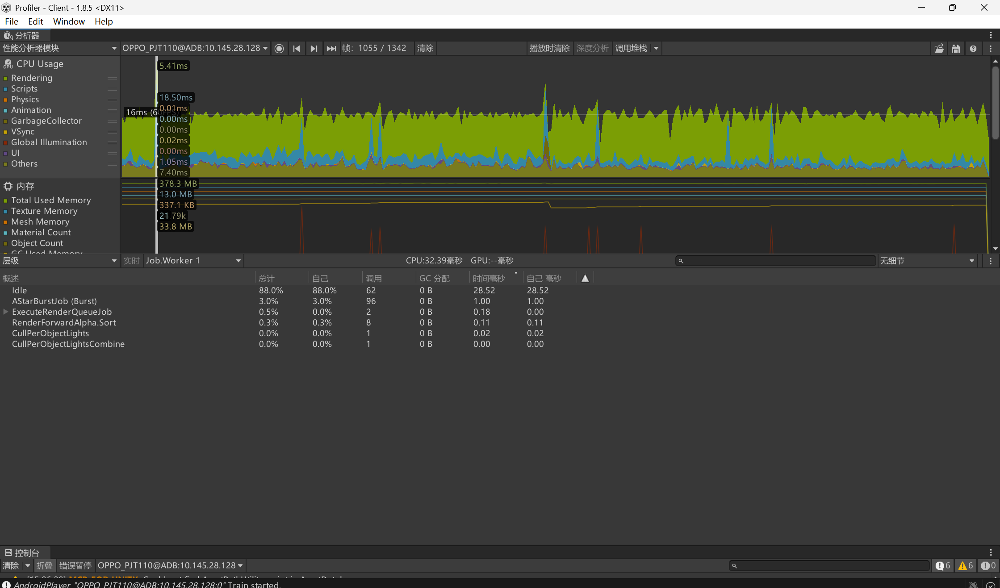

> **图8：Job Worker 线程活动** — `Job.Worker 1` 显示 `AStarBurstJob (Burst)` 占 3.0%，`ExecuteRenderQueueJob` 等渲染 Job 共 ~0.8%。Worker 88% 时间空闲，说明 Job 系统负载不饱和，瓶颈不在 Worker 端而在 Complete 等待。

---

## Phase 3：预算型微批处理 — 峰值削平（最终方案）

### 改造目标

从"一帧全部算完"改为"每帧只算固定配额，算不完下帧继续"，削平峰值帧。

### 核心理念

> 不是"算得更快"，而是"每帧只算一点点，算不完的留到下一帧"。

```
旧模式（Route B 全量批处理）:
  40 单位寻路 → 全部 Schedule → 一次 Complete
  → 40 单位 × 8 A*/单位 = 320 个 Job → 帧时间爆炸

新模式（预算型微批处理）:
  40 单位寻路 → 只取前 8 个单位 → Schedule 64 个 Job → Complete
  剩余 32 个单位 → 留在队列 → 下一帧继续
  → 峰值削平，帧时间稳定
```

### 关键改动

#### 1. Pool 缩减

| 参数 | 旧值 (Route B) | 新值 | 说明 |
|------|---------------|------|------|
| `ASTAR_POOL_SIZE` | 512 | 64 | 内存占用降低 88% |
| `MAX_PATH_SLOTS_PER_FRAME` | — | 64 | 每帧最多处理的 A* Job 数 |
| `MAX_PATH_UNITS_PER_FRAME` | — | 8 | 每帧最多处理的寻路单位数 |

#### 2. 跨帧持久队列

```csharp
// Battle.cs 新增字段
private const int MAX_PATH_UNITS_PER_FRAME = 8;
private readonly HashSet<int> _pendingRepathSet = new HashSet<int>();  // O(1) 去重
// _batchPathUnitQueue 从"每帧清空重建"变为"跨帧持久"
```

#### 3. ProcessRepathQueueWithBudget 双预算控制

```csharp
while (queueIdx < _batchPathUnitQueue.Count && unitsProcessed < MAX_PATH_UNITS_PER_FRAME)
{
    // 单位级预算检查
    if (slotsUsed + cornerCount > MAX_PATH_SLOTS_PER_FRAME)
        break;  // 槽位不够，下帧继续

    // Schedule 该单位的所有候选方向 A*
    unitsProcessed++;
    slotsUsed += cornerCount;
}

// 统一 Flush（每帧仅 1 次 Complete）
// 成功的：从 _pendingRepathSet 移除
// 失败/超出预算的：留在队列，下帧自动重试
```

#### 4. ExecuteFrame 两趟遍历

```
第一趟：所有单位执行移动+攻击
  - target 仍然有效 → 从 _pendingRepathSet 移除（无需重寻路）
  - target 丢失且不在队列 → 加入 _pendingRepathSet

ProcessRepathQueueWithBudget()
  - while 循环，最多取 8 个单位
  - Schedule → Flush → Read → 分配路径
  - 成功则移出队列，失败则留待下帧

第二趟：已拿到路径的单位执行移动
```

### 最终效果

| 指标 | Job 引入后 (Route B) | 预算型微批处理 (最终) | 提升 |
|------|---------------------|---------------------|------|
| **ExecuteFrame 帧时间** | ~22ms | **~4.5ms** | **~5x** |
| FPS | ~31 | **稳定 60+** | **~2x** |
| 峰值帧抖动 | 明显可感知 | **无突兀峰值** | 实质消除 |
| Complete 次数/帧 | 多次 | **1~3 次** | 大幅减少 |
| GC.Alloc (热路径) | 0 B | **0 B** | 保持 |
| 托管堆 | ~38 MB | **~28 MB** | 降低 |
| A* Pool 内存 | 512 槽 | **64 槽** | **-88%** |

### 证据截图

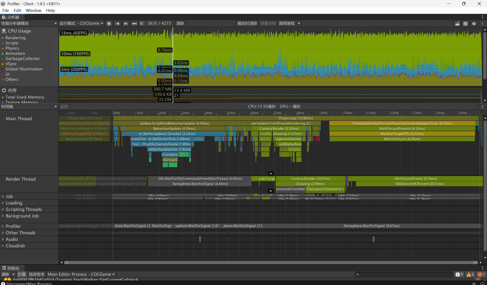

> **图9：最终 Timeline** — 帧时间稳定在 8-16ms 范围内，`UI_Battle.Update` 仅 3.23ms，`BehaviourUpdate` 4.39ms。主线程和渲染线程工作分布均衡，无显著等待。

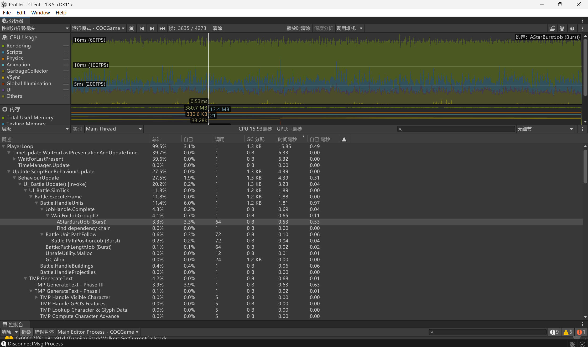

> **图10：最终层级** — `UI_Battle.Update` 仅 20.2%，`Battle.ExecuteFrame` 11.8%，`Battle.HandleUnits` 11.4%。`AStarBurstJob (Burst)` 3.3%。关键指标：**GC 分配列全部为 0 B**，热路径零分配。

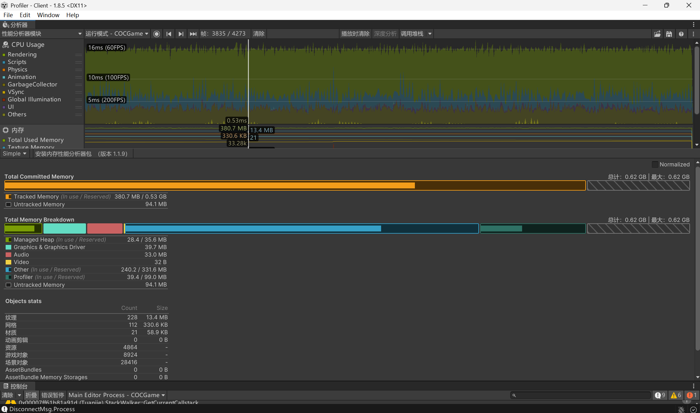

> **图11：最终内存** — 总内存 0.62 GB（含 Profiler 自身 39.4 MB），托管堆仅 28.4 MB。无 GC 尖峰，CPU 时间线平滑稳定。纹理 13.4 MB，网格 330.6 KB，资产使用高效。

---

## 优化路径总结

```
Phase 0: 稳定战斗基线
  ├─ 帧时间: 33~54ms, FPS: ~18-30
  ├─ 核心问题: LINQ + new List + GC.Collect 在热路径
  └─ GC 暂停 42ms → 严重卡顿

         ↓ 移除托管分配 + 值类型改造

Phase 1: Burst 改造
  ├─ 帧时间: ~49ms(峰值), GC 明显下降
  ├─ 核心改动: 去 LINQ、NativeArray、Burst Job、Grid Epoch
  └─ 路径数学 Burst 编译执行，但寻路仍为串行 Run

         ↓ 引入 Job 并行调度

Phase 2: Job 多线程
  ├─ 帧时间: ~32ms(峰值), FPS: ~31
  ├─ 核心改动: Schedule+Complete、Scratch Pool、批量 Flush
  ├─ Worker Thread 成功执行 AStarBurstJob
  └─ Route B 探索(512槽全量): ~22ms → 暴露 Complete 瓶颈

         ↓ 预算削峰 + 跨帧分摊

Phase 3: 预算型微批处理 (最终)
  ├─ 帧时间: ~4.5ms, FPS: 稳定 60+
  ├─ 核心改动: 8单位/帧预算、跨帧持久队列、双预算控制
  └─ Complete 从每单位多次降至每帧 1~3 次
```

### 核心技术栈

| 层级 | 技术 | 作用 |
|------|------|------|
| 内存管理 | `NativeArray<T>` / `NativeList<T>` | 消除托管堆分配，GC-Free |
| 编译器优化 | `[BurstCompile]` / `IJob` | SIMD 优化 + AOT 编译 |
| 并行调度 | `IJob.Schedule()` + `JobHandle.Complete()` | 多核 Worker Thread 并行 |
| 模式设计 | Scratch Pool + 三阶段流水线 | 复用预分配内存，批量调度 |
| 帧预算 | 预算型微批处理 + 跨帧队列 | 峰值削平，帧时间稳定 |

### 关键经验

1. **先消除 GC，再考虑并行** — Phase 1 的 GC 消除是后续所有优化的前提。托管分配不解决，并行再多也白搭。
2. **并行不是免费的** — `JobHandle.Complete()` 是同步等待，Job 数量越多等待越久。Route B 的 512 槽方案证明了这一点。
3. **峰值削平比平均优化更有效** — 用户感知的是最慢那一帧。预算型微批处理从 22ms 降到 4.5ms，消除了感知卡顿。
4. **数据结构扁平化是 Burst 的前提** — class → struct、`Cell[,]` → flat array、引用链 → 值数组，每一步都在为编译器和 SIMD 铺路。
5. **ECS 骨架预留，不急于全面迁移** — ECS World 已搭建但默认关闭（`EnableECS = false`），只在确实需要大规模 Entity 数量时才启用。

---

## 图片索引

| 图片 | 阶段 | 说明 |
|------|------|------|
| `Client/DOTS/稳定战斗Timeline（初）.png` | Phase 0 | 初始 Timeline：54ms 帧，主线程阻塞 |
| `Client/DOTS/稳定战斗层级(初）.png` | Phase 0 | 初始层级：HandleUnits 73.6%，GC.Collect 7.4% |
| `Client/DOTS/稳定战斗内存（初）.png` | Phase 0 | 初始内存：42ms GC 暂停，托管堆 38.6 MB |
| `Client/DOTS/Brsut优化Timeline.png` | Phase 1 | Burst 后 Timeline：GC 下降，主线程仍 49ms |
| `Client/DOTS/Brust优化层级（GC明显下降）.png` | Phase 1 | Burst 后层级：GC 分配降至 33.8 KB |
| `Client/DOTS/Job引入后峰值Timelie.png` | Phase 2 | Job 后 Timeline：32ms 帧，Worker Thread 活跃 |
| `Client/DOTS/Job引入后峰值层级.png` | Phase 2 | Job 后层级：AStarBurstJob 8.7%，FindTargets 63.3% |
| `Client/DOTS/Job引入后峰值Jobworker.png` | Phase 2 | Job Worker：AStarBurstJob 在 Worker 线程执行 |
| `Client/DOTS/最后Timeline.png` | Phase 3 | 最终 Timeline：帧时间 8-16ms 稳定 60+ FPS |
| `Client/DOTS/最后层级.png` | Phase 3 | 最终层级：GC 分配 0 B，ExecuteFrame 11.8% |
| `Client/DOTS/最后内存.png` | Phase 3 | 最终内存：托管堆 28.4 MB，无 GC 尖峰 |

---

> 原始仓库：[developers-hub-org/clash-of-clans-clone](https://github.com/developers-hub-org/clash-of-clans-clone)
> 本项目为学习用途的性能优化版本，基于原项目进行了 Burst/Jobs/ECS 等 DOTS 技术栈的深度优化改造。
